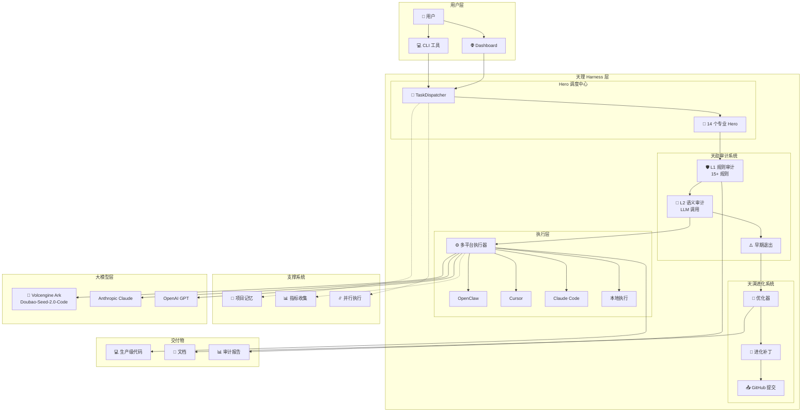
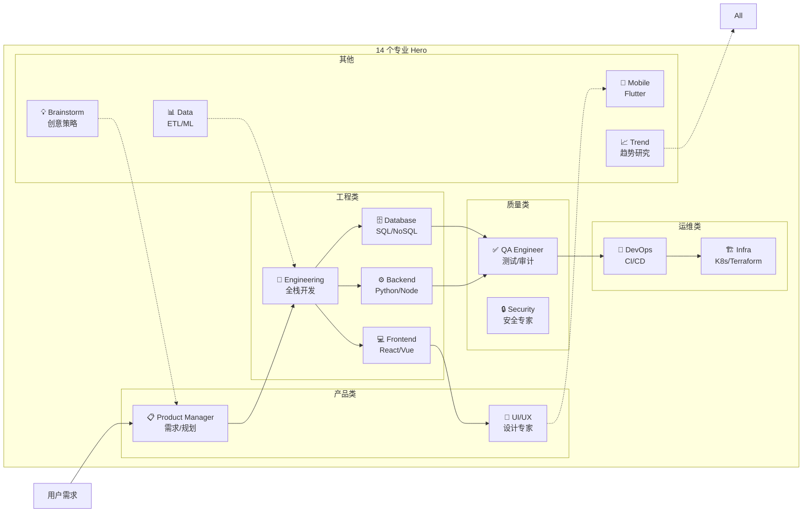
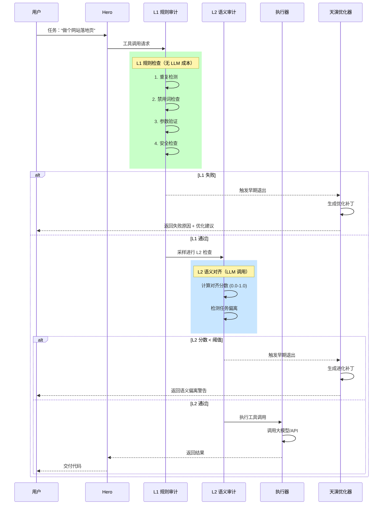
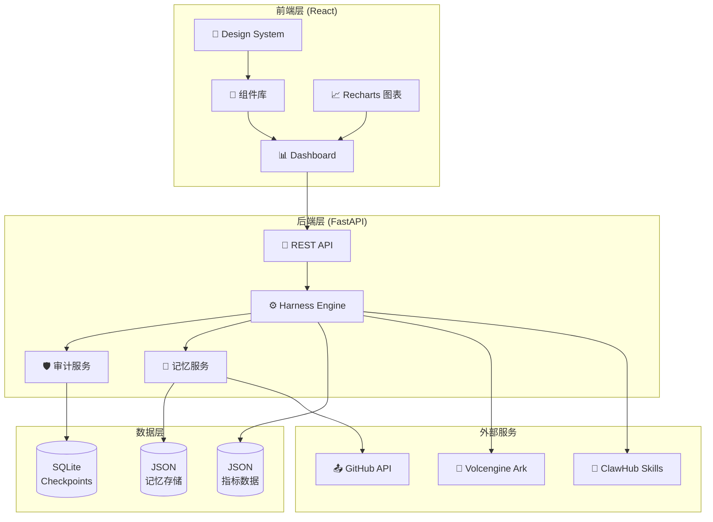
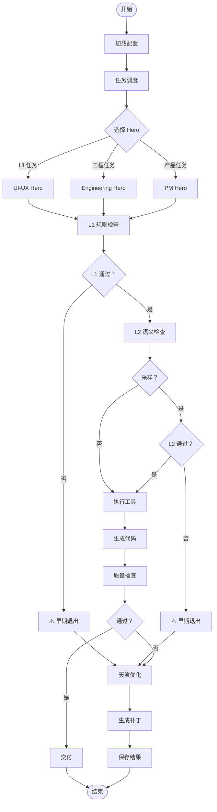
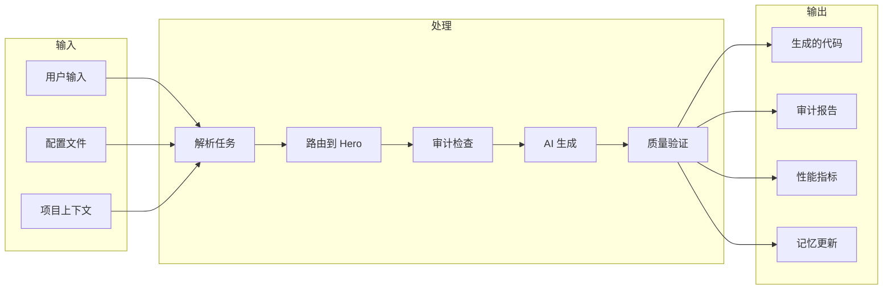
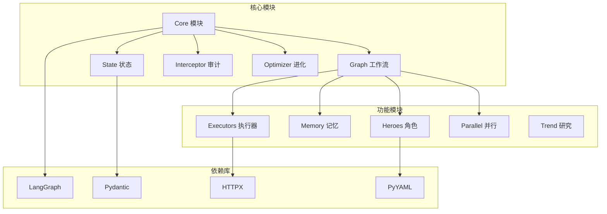
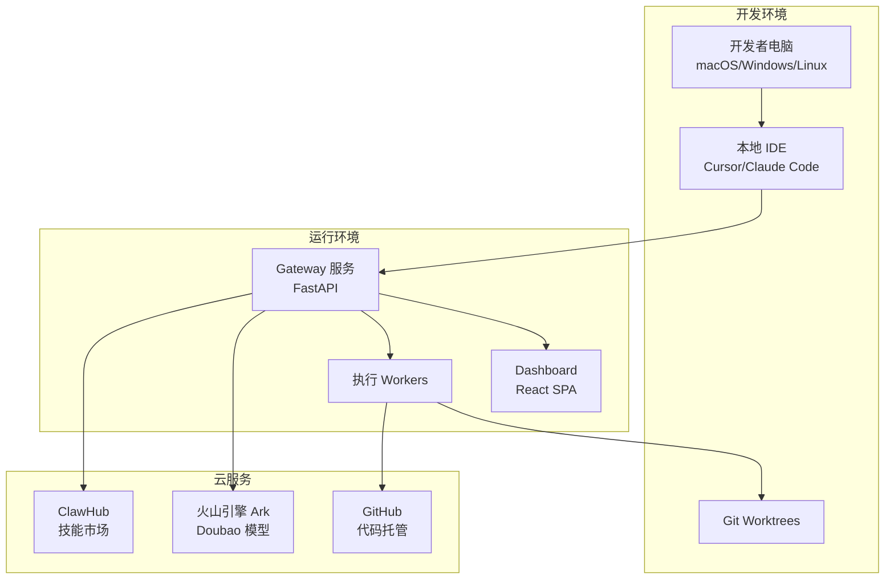

# 天理项目架构图

**项目：** TianLi Harness  
**GitHub:** https://github.com/seastaradmin/TianLi  
**更新日期：** 2026-03-24

---

## 🏗️ 系统架构总览

---

## 🦸 Hero 角色架构

---

## 🛡️ 天劫审计流程

---

## 📦 前后端架构

---

## 🔄 完整执行流程

---

## 📊 数据流架构

---

## 🎯 核心模块依赖

---

## 🏢 部署架构

---

**文档生成：** TianLi Harness  
**生成时间：** 2026-03-24  
**版本：** v0.1.0
