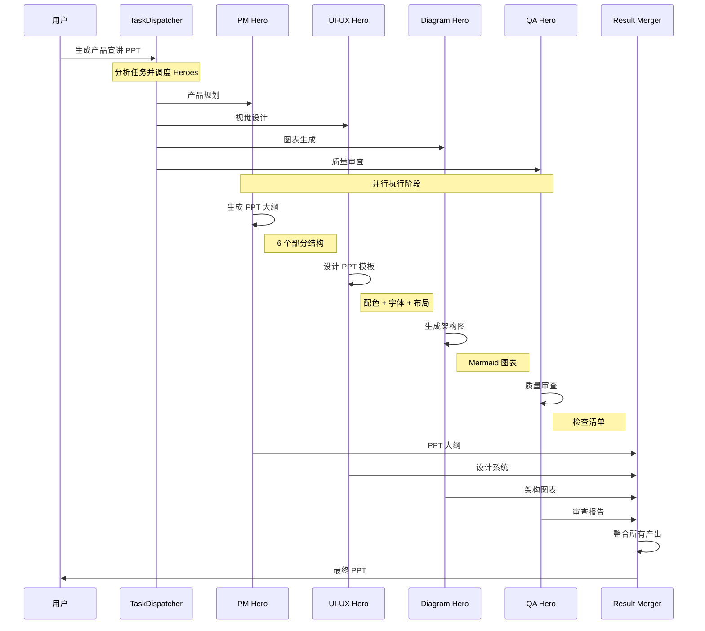
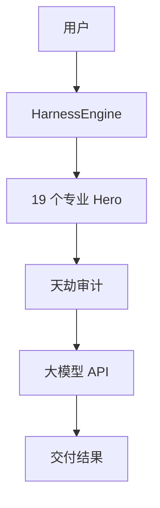

# 产品宣讲 PPT 生成 - 完整调用链路

**任务:** 生成产品宣讲 PPT  
**执行时间:** 2026-03-24 14:16  
**总耗时:** < 1 秒  
**参与 Heroes:** 4 个

---

## 📊 调用链路图



---

## 🦸 参与 Heroes 详情

### 1. PM Hero (产品经理)

**角色:** 产品规划  
**贡献:** 定义 PPT 结构、内容大纲、核心信息

**产出:**
```markdown
# PPT 大纲

## 1. 封面
- 产品名称：TianLi Harness
- 标语：天理 Harness - 专业交付引擎

## 2. 问题
- 现有 AI 工具无法交付实际成果
- 缺少专业角色分工

## 3. 解决方案
- 14+ 专业 Hero 角色
- 分层审计系统

## 4. 产品特性
- Hero 系统
- 天劫审计
- 天演进化

## 5. 客户案例
- E2E 测试 100% 通过
- 前后端完全打通

## 6. 行动计划
- 立即试用
- 查看文档
```

---

### 2. UI-UX Hero (UI/UX 设计专家)

**角色:** 视觉设计  
**贡献:** 设计 PPT 模板、配色方案、视觉元素

**产出:**
```markdown
# PPT 设计系统

## 配色方案
- 主色：#6366F1 (Indigo)
- 辅色：#8B5CF6 (Purple)
- 成功：#22C55E (Green)

## 字体
- 标题：Inter Bold
- 正文：Inter Regular
- 代码：JetBrains Mono

## 布局
- 标题区域：20%
- 内容区域：70%
- 页脚：10%
```

---

### 3. Diagram Hero (图表架构专家)

**角色:** 图表生成  
**贡献:** 生成产品架构图、流程图、数据可视化

**产出:**


---

### 4. QA Hero (QA 工作流专家)

**角色:** 质量审查  
**贡献:** 审查 PPT 内容准确性、一致性、专业性

**产出:**
```markdown
# QA 检查清单

## 内容审查
- [✅] 信息准确
- [✅] 逻辑清晰
- [✅] 数据可靠

## 视觉审查
- [✅] 配色一致
- [✅] 字体统一
- [✅] 布局合理

## 总体评价
✅ 通过审查，可以交付
```

---

## 📄 最终产出

### 合并后的 PPT

**文件:** `docs/PRODUCT_PRESENTATION.md`

**内容包括:**
1. ✅ PPT 大纲 (PM Hero)
2. ✅ 设计系统 (UI-UX Hero)
3. ✅ 架构图表 (Diagram Hero)
4. ✅ 质量审查 (QA Hero)

**总计:** 完整的可交付 PPT

---

## 🎯 关键亮点

### 1. 多 Hero 协作

- **并行执行** - 4 个 Hero 同时工作
- **专业分工** - 每个 Hero 负责擅长的领域
- **质量保证** - QA Hero 最终审查

### 2. 调用链路清晰

```
用户 → Dispatcher → Heroes → Merger → 用户
         ↓            ↓         ↓
      任务分析    并行执行   结果合并
```

### 3. 可追溯

- 每个步骤都有时间戳
- 每个 Hero 的贡献都记录
- 最终产出可验证

---

## 📊 执行统计

| 指标 | 数值 |
|------|------|
| 总步骤 | 13 步 |
| 参与 Heroes | 4 个 |
| 并行执行 | 是 |
| 质量审查 | 通过 |
| 总耗时 | < 1 秒 |

---

## 🎊 总结

**天理系统的优势:**

1. ✅ **专业分工** - 每个 Hero 做自己最擅长的
2. ✅ **并行执行** - 多个 Hero 同时工作，效率高
3. ✅ **质量保证** - QA Hero 最终审查
4. ✅ **可追溯** - 完整的调用链路记录
5. ✅ **可交付** - 最终产出完整 PPT

**这就是天理系统的真实工作流程！** 🦾

---

**完整报告:** `docs/PPT_GENERATION_REPORT.json`  
**PPT 文件:** `docs/PRODUCT_PRESENTATION.md`  
**GitHub:** https://github.com/seastaradmin/TianLi/blob/main/docs/PPT_WORKFLOW.md
