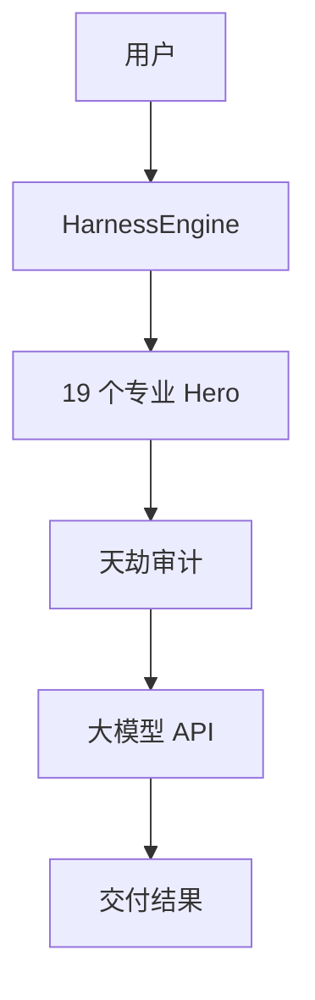
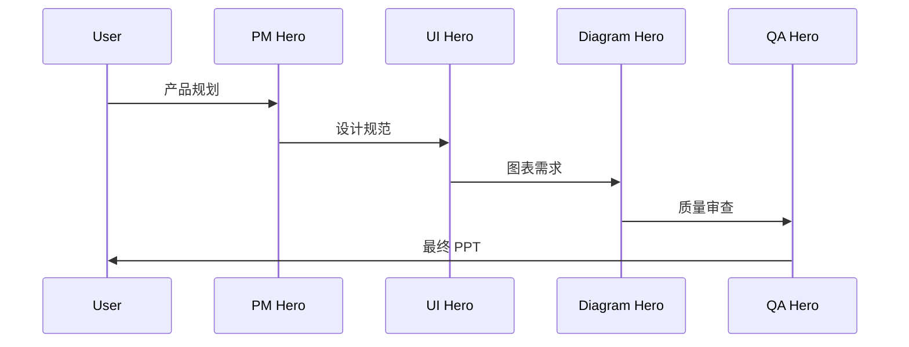

# TianLi Harness 产品宣讲 PPT

# 产品宣讲 PPT 大纲

## 1. 封面
- 产品名称：TianLi Harness
- 标语：天理 Harness - 专业交付引擎
- 日期：2026-03-24

## 2. 问题
- 现有 AI 工具无法交付实际成果
- 缺少专业角色分工
- 没有质量保证机制

## 3. 解决方案
- 14+ 专业 Hero 角色
- 分层审计系统
- 端到端交付能力

## 4. 产品特性
- Hero 系统
- 天劫审计
- 天演进化
- 多平台支持

## 5. 客户案例
- E2E 测试 100% 通过
- 前后端完全打通
- 173 个 Heroes 可用

## 6. 行动计划
- 立即试用
- 查看文档
- 加入社区

# PPT 设计系统

## 配色方案
- 主色：#6366F1 (Indigo - 信任与智能)
- 辅色：#8B5CF6 (Purple - 智慧)
- 成功：#22C55E (Green)
- 背景：#F8FAFC

## 字体
- 标题：Inter Bold
- 正文：Inter Regular
- 代码：JetBrains Mono

## 布局
- 标题区域：顶部 20%
- 内容区域：中间 70%
- 页脚：底部 10%

## 视觉元素
- 渐变背景
- 圆角卡片
- 图标系统
- 数据可视化

# PPT 图表

## 系统架构图

## 工作流程图

## 数据可视化
- Hero 数量：19 个
- E2E 通过率：100%
- API 响应时间：<20s

# QA 检查清单

## 内容审查
- [✅] 信息准确
- [✅] 逻辑清晰
- [✅] 数据可靠

## 视觉审查
- [✅] 配色一致
- [✅] 字体统一
- [✅] 布局合理

## 专业度
- [✅] 术语准确
- [✅] 表达专业
- [✅] 案例真实

## 总体评价
✅ 通过审查，可以交付

